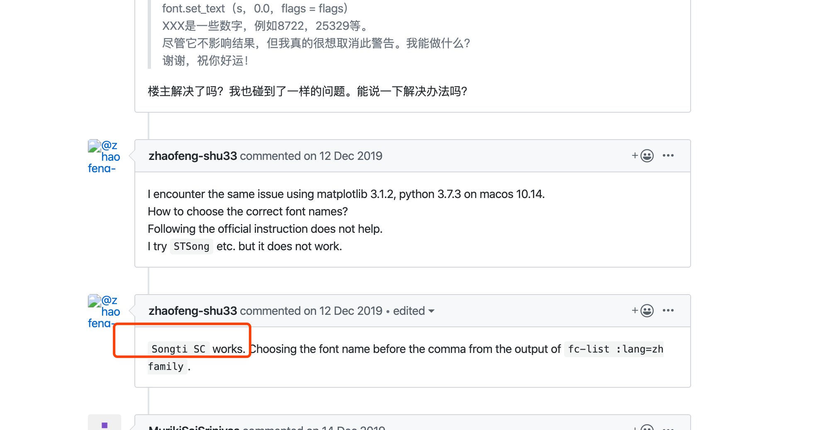

# **新闻数据自动摘要**

- [ ] 项目完成：2020年3月15日
- [ ] 数据处理：2020年2月15日-2月22日
- [ ] 模型搭建：2020年2月23日-2月29日
  - [ ] 模型优化：2020年3月1日-3月15日
- [ ] 模型可视化：2020年3月1日-3月15日

# 1 数据预处理

## 数据提取

### WikiExtractor工具   <https://github.com/attardi/wikiextractor>

~~~
WikiExtractor.py [-h] [-o OUTPUT] [-b n[KMG]] [-c] [--json] [--html]
                        [-l] [-s] [--lists] [-ns ns1,ns2]
                        [--templates TEMPLATES] [--no-templates] [-r]
                        [--min_text_length MIN_TEXT_LENGTH]
                        [--filter_category path_of_categories_file]
                        [--filter_disambig_pages] [-it abbr,b,big]
                        [-de gallery,timeline,noinclude] [--keep_tables]
                        [--processes PROCESSES] [-q] [--debug] [-a] [-v]
                        [--log_file]
                        input
eg:                  
WikiExtractor.py -o wiki_articles.txt /Users/stone/PycharmProjects/kkb_projects/project1/data/zhwiki-20191120-pages-articles-multistream.xml.bz2
~~~

### 数据处理

- 文本过滤特殊字符，空格等

- 结巴分词，并进行文本保存

## 词向量

### 词向量构建

### 测试词向量效果

### 词向量可视化

- 可视化词向量-TSNE	使用

  参考网址：

  1. <https://blog.csdn.net/Class_guy/article/details/89014779>

  2. <https://www.kaggle.com/jeffd23/visualizing-word-vectors-with-t-sne>

     

## 句向量

- 句向量

  <https://www.cnblogs.com/llhthinker/p/10335164.html>

- 权重计算

# 2 核心模型搭建

- 相似度模型
- KNN平滑
- 模型调优

# 3 可视化

- flask, bottle, bootstrap

# 4 分工

可视化：张兆康 + 严鹏协助

模型：俞谷阳 + 姚林霞协助

数据预处理+训练词向量：严鹏 + 姚林霞

# **5 参考资料**

## KNN平滑

- <http://www.feingto.com/?p=27534>

# questions

## matplotlib中文显示

尝试了网上四种方法，分别如下：

~~~
#### 1 macOS系统原因，字体换成Songti SC解决
matplotlib.rcParams['font.family'] = 'Songti SC'
matplotlib.rcParams['font.size'] = 10
#### 2
# plt.rcParams['font.sans-serif'] = ['SimHei'] # 指定默认字体
# plt.rcParams['axes.unicode_minus'] = False # 解决保存图像是负号'-'显示为方块的问题

#### 3
# myfont = matplotlib.font_manager.FontProperties(
#     fname='/Users/stone/Library/Fonts/SimHei.ttf')
# matplotlib.rcParams['axes.unicode_minus'] = False

#### 4
# plt.rcParams['font.family'] = ['sans-serif']
# plt.rcParams['font.sans-serif'] = ['SimHei']
~~~

**参考网址：**<https://github.com/matplotlib/matplotlib/issues/15062>

